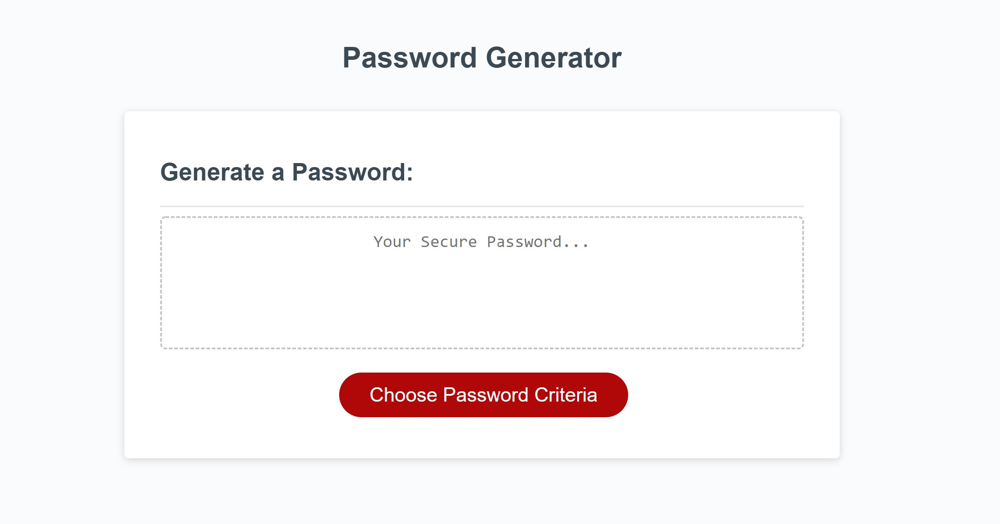

# Kcasey's Quick Password Generator

## About
This is my first JavaScript project. This password generator will create a password of a custom length using lowercase letters, uppercase letters, numbers, and symbols. 

The password length box will allow a password length of 8 to 128 characters. *With the default being 12 characters.*

Each function regarding the selectable password criteria will run only if their respected check box is selected.

## Website's Functionality:

The following image demonstrates the web application's default appearance and functionality:

## Deployed Application

This site is hosted by github pages.

To view the site please click [here](https://kcaseychamberlain.github.io/quick-password-generator/).

